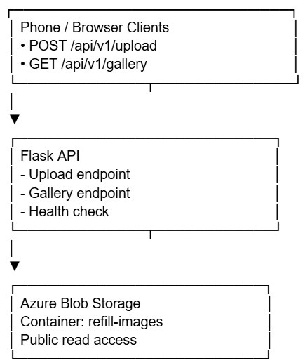
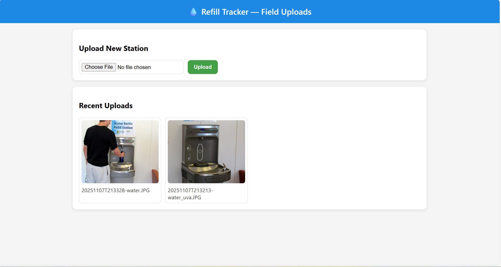
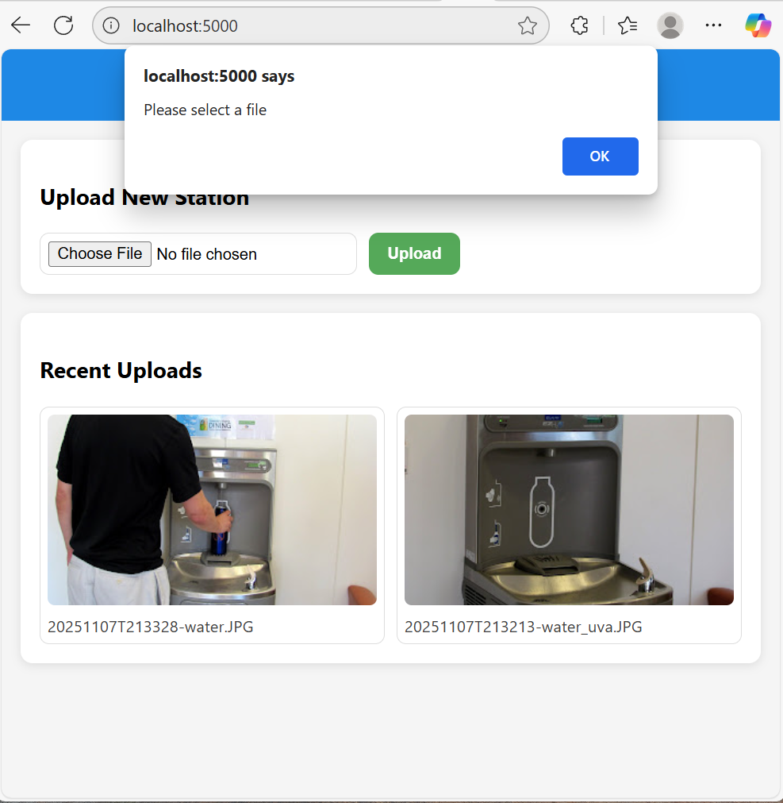
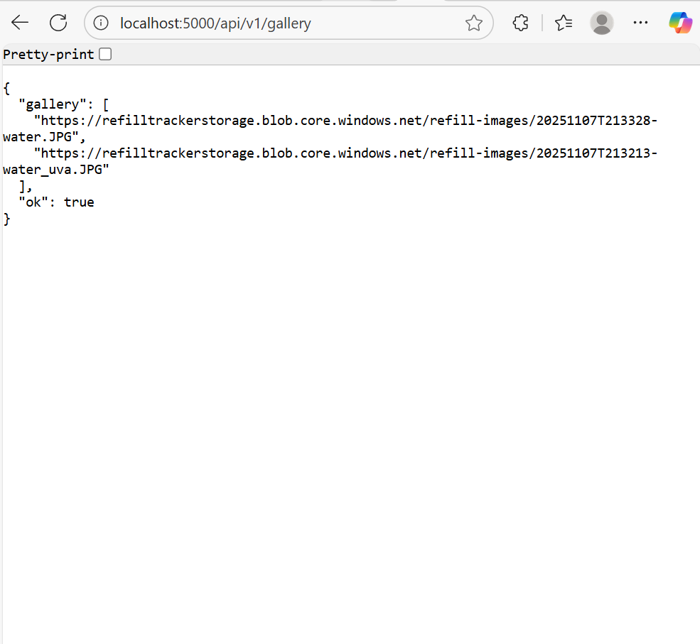
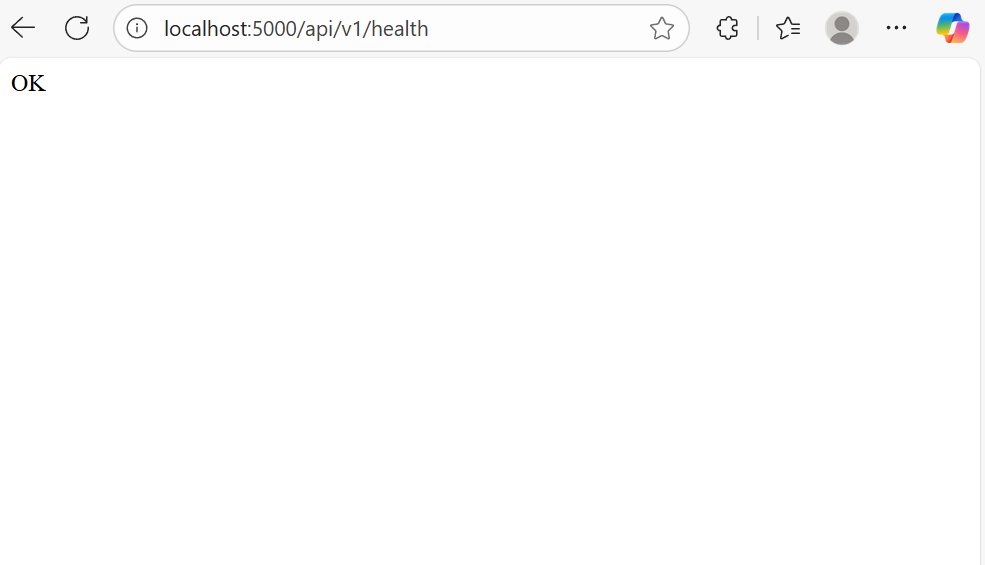

# Refill Tracker 
**Author:** Olivia Teng  

---

## 1) Executive Summary

**Problem:**  
As college students at UVA, many busy students find themselves parched and thirsty between the classes, meetings, and extracurriculars they have. After their first year (where it becomes a necessity and routine to refill water bottles at the dining hall), upperclassmen face an issue of hardly finding free water available. Additionally, students never know the state, condition, or what kind of water station is around.

**Solution:**  
Refill Tracker is a web app that lets users upload photos of refill stations and view them in a public gallery within seconds. This public gallery allows students to see the type of refill station they can find (water fountain, automatic dispenser, etc.), the area around the water station so they can know where to find them, and whether or not the refill station they want to visit has a clean or dirty filter from the red/green light.

---

## 2) System Overview

**Course Concept(s):**
- Flask API
- Azure Blob Storage integration
- Containerization with Docker

### Architecture Diagram


### Data/Services
| Component | Description |
|------------|-------------|
| **Backend** | Flask app served on Azure App Service |
| **Storage** | Azure Blob (container: `refill-images`, public-read) |
| **Containerization** | Dockerfile builds reproducible image |
| **Frontend** | HTML + JS (responsive, phone-friendly) |

License: MIT

---

## 3) How to Run Locally

### Run with Docker 
```bash
docker build -t refilltracker:latest .
docker run --rm -p 5000:5000 --env-file .env refilltracker:latest
```

## 4) Design Desicions
| Decision           | Reason                                        |
| ------------------ | --------------------------------------------- |
| **Flask API**      | Lightweight, ideal for field upload workflows |
| **Azure Blob**     | Cheap, scalable public image hosting          |
| **Docker**         | Ensures reproducibility and easy deployment   |
| **.env file**      | Keeps credentials separate from code          |
| **Public Gallery** | Allows quick verification from any phone      |

Refill Tracker streamlines image collection from field users to monitor water refill stations. It was designed with a goal to be a mobile-friendly upload service that could intake real-time image submissions and instantly display them in a public gallery for view. 

### Why this concept?
Refill Tracker addresses a real-world need for UVA students that does not exist in the UVA environment currently. Many needs are addressed, such as advising, food, mental well-being, but a simple need of hydration is overlooked. Refill Tracker is a simle and easy way for students to keep up healthy hydration. 

### Alternatives: Why not chosen
Full CMS (e.g. Wordpress): too ehavy for single-purpose field data collection tool
REST API + React front end: deployment more complex, flask sufficient for scale and simplicity
AWS S3: Azure Blob Storage integrates directly with App Service and provides free student-tier credits
Authentication System: unnecessary for target audience, priority is easy public access

### Tradeoffs
| Area                | Decision                                          | Tradeoff                                                                        |
| ------------------- | ------------------------------------------------- | ------------------------------------------------------------------------------- |
| **Performance**     | Flask with simple blob operations                 | Not as fast as async frameworks (like FastAPI), but simpler and easier to debug |
| **Cost**            | Uses Azure B1 (free/low-cost) tier                | Limited compute resources and cold starts after idle                            |
| **Complexity**      | Minimal routes (`/upload`, `/gallery`, `/health`) | Limited features (no user roles, no thumbnails)                                 |
| **Maintainability** | Flat architecture (no blueprints or database)     | Easier to maintain short-term, harder to extend for large-scale projects        |

### Security & Privacy

Secrets Management: Azure connection string and account string are stored in .env and loaded using python-dotenv. This usees Azure App settings instead of hardcoding secrets.

Input Validation: Upload route checks image type and extenstion. The image sizes are sanitized as well with werkzeug.utils.secure_filename().

PII Handling: No personal data is stored or processed. Only the image files and public URLs are managed. 

### Ops

Logs: Flask logs requests and uploads activity (viewed in Azure App Service log stream).

Scaling: App Service Plan (B1) supports vertical scaling if it is needed and the stateless Flask design allows for easy horizontal scaling. 

Known Limitations: no image resizing or prevention of dulicates, public container means URLs are visible, upload rate is limited by the App Service

## 5) Results
Web App and Gallery View with Uploaded Images Run with Docker:

Check for file:

Gallery Check:

Health Check:


### Performance Notes
Startup time: ~5-7 seconds
Upload latency: ~1-2 seconds for a 2 MB image
Storage: Azure Blob Storage (public-read container refill-images)

### 7) What's Next
Add GPS metadata to enhance location

Add categories of stations in similar areas

### Links
GitHub Repo: https://github.com/oliviatenguva/refill-tracker
Azure Web App: https://refilltracker-app.azurewebsites.net
Service URL: https://refill-tracker-app.azurewebsites.net